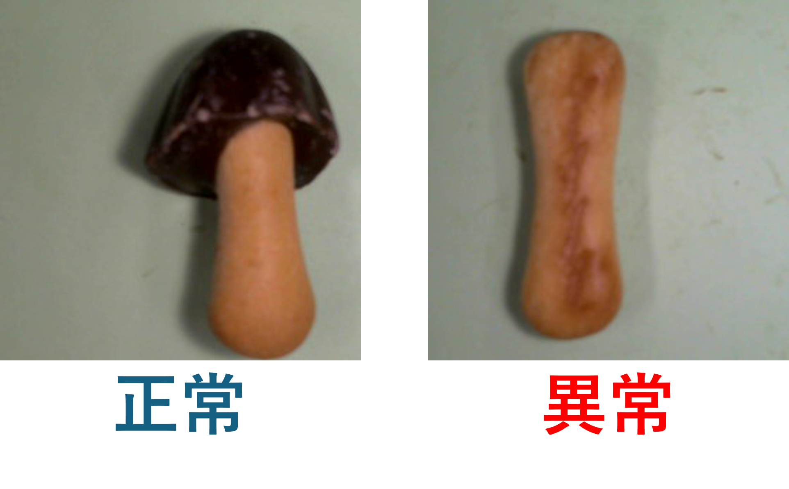

# MLOpsセミナー追加実習
本実習はオートエンコーダーで画像の異常検知を行うタスクです。プログラムは完成しています。ハイパーパラメータチューニングによるPoCと実験・モデル管理、運用環境(Jetson)で学習済みモデルを読み込み推論精度の確認までが体験できます。

3つのプロジェクトについて

### create_traindata
比較的簡単にPCにUSBカメラを接続し、本プログラムを実行することで学習データの作成が可能です。利用方法は create_traindata ディレクトリ内の README.md をご確認ください。

### autoencoder_poc
オートエンコーダーモデルのPoCを実行します。各種設定は config.yaml で行い、MLflowと連携して実験の記録や学習済みモデルの保存を管理します。詳しい利用方法は autoencoder_poc ディレクトリ内の README.md をご確認ください。

### autoencoder_inference
学習済みモデルを読み込み、接続したUSBカメラの映像を用いてリアルタイム推論および精度確認が可能です。推論に関する設定は config.yaml で行います。 また、本プログラムは運用環境（Jetson）でも同様に動作・確認が可能です。詳しい利用方法は autoencoder_inference ディレクトリ内の README.md をご参照ください。


# 実習における異常検知について
本実習では、「きのこの山」を対象とした異常検知を実施します。 今回は、チョコレート部分が欠損しているものを「異常」と定義します。



# オートエンコーダーについて
オートエンコーダーは、入力された画像を一度圧縮し、それを再構成（復元）するニューラルネットワークです。
本実習では、AIに　**「正常な形」だけを学習** させます。これにより、欠けたきのこの山（異常データ）が入力された際、AIはうまく復元できず、元の画像との間に大きな「ズレ（誤差）」が生じます。このズレの大きさを見て異常を検知します。


そのため、学習データには正常データのみを使用します。ディレクトリ構成は以下の通りです。

```
autoencoder_poc  
└── data  
    ├── train  
    │   └── good  
    │       ├── 学習用正常画像1.png  
    │       ├── 学習用正常画像2.png  
    │       └── ...  
    └── test  
        ├── good  
        │   ├── 検証用正常画像1.png  
        │   ├── 検証用正常画像2.png  
        │   └── ...  
        └── anomaly  
            ├── 検証用異常画像1.png  
            ├── 検証用異常画像2.png  
            └── ...  
```

上記のフォルダ構成を崩さなければ他の異常検知のタスクにそのままプログラムを利用することも可能です。その際はcreate_traindataのプログラムでデータを比較的簡単に作成できます

# 環境の構築方法

git cloneで本リポジトリをクローンします。
```bash
git clone https://github.com/toshiyanakamura/mlops-autoencoder.git
```

以下のuvコマンドで仮想環境を構築します
```bash
uv venv -p 3.8
uv sync
uv pip install torch==2.1.0 ^
               torchvision==0.16.0 ^
               torchaudio==2.1.0 ^
               --index-url https://download.pytorch.org/whl/cu121
```