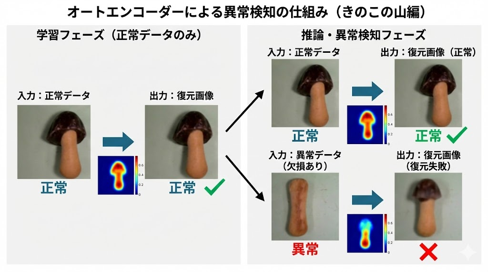
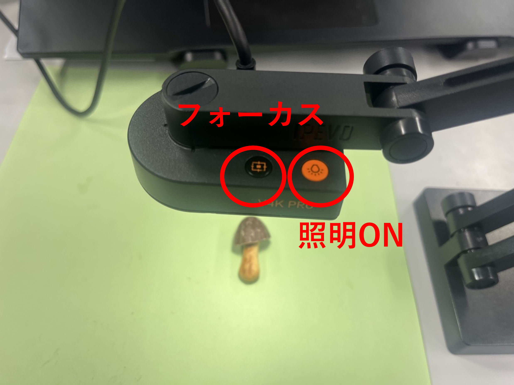

# MLOpsセミナー追加実習
本実習はオートエンコーダーで画像の異常検知を行うタスクです。プログラムは完成しています。ハイパーパラメータチューニングによるPoCと実験・モデル管理、運用環境(Jetson)で学習済みモデルを読み込み推論精度の確認までが体験できます。

最終的に運用環境(Jetson)でリアルタイム推論のテストをするのがゴールです。


3つのプロジェクトについて

### create_traindata
比較的簡単にPCにUSBカメラを接続し、本プログラムを実行することで学習データの作成が可能です。利用方法は create_traindata ディレクトリ内の README.md をご確認ください。

### autoencoder_poc
オートエンコーダーモデルのPoCを実行します。各種設定は config.yaml で行い、MLflowと連携して実験の記録や学習済みモデルの保存を管理します。詳しい利用方法は autoencoder_poc ディレクトリ内の README.md をご確認ください。

### autoencoder_inference
学習済みモデルを読み込み、接続したUSBカメラの映像を用いてリアルタイム推論および精度確認が可能です。推論に関する設定は config.yaml で行います。 また、本プログラムは運用環境（Jetson）でも同様に動作・確認が可能です。詳しい利用方法は autoencoder_inference ディレクトリ内の README.md をご参照ください。


# 実習における異常検知について
本実習では、「きのこの山」を対象とした異常検知を実施します。 今回は、チョコレート部分が欠損しているものを「異常」と定義します。


# オートエンコーダーについて
オートエンコーダーは、入力された画像を一度圧縮し、それを再構成（復元）するニューラルネットワークです。
本実習では、AIに　**「正常な形」だけを学習** させます。これにより、欠けたきのこの山（異常データ）が入力された際、AIはうまく復元できず、元の画像との間に大きな「ズレ（誤差）」が生じます。このズレの大きさを見て異常を検知します。




そのため、学習データには正常データのみを使用します。ディレクトリ構成は以下の通りです。

```
autoencoder_poc  
└── data  
    ├── train  
    │   └── good  
    │       ├── 学習用正常画像1.png  
    │       ├── 学習用正常画像2.png  
    │       └── ...  
    └── test  
        ├── good  
        │   ├── 検証用正常画像1.png  
        │   ├── 検証用正常画像2.png  
        │   └── ...  
        └── anomaly  
            ├── 検証用異常画像1.png  
            ├── 検証用異常画像2.png  
            └── ...  
```

上記のフォルダ構成を崩さなければ他の異常検知のタスクにそのままプログラムを利用することも可能です。その際はcreate_traindataのプログラムでデータを比較的簡単に作成できます

# USBカメラについて
本実習のオートエンコーダーへの入力画像のサイズは、再現性を高めるため256×256とします。256×256の枠内で最大の大きさに対象が映るようにカメラの高さを調整してください。オートフォーカスなのでフォーカスボタンで対象物にピントを合わせてください。学習データ作成時は照明ONで撮影しています。




# 環境の構築方法

git cloneで本リポジトリをクローンします。
```bash
git clone https://github.com/toshiyanakamura/mlops-autoencoder.git
```

以下のuvコマンドで仮想環境を構築します
```bash
uv venv -p 3.8
uv sync
uv pip install torch==2.1.0 ^
               torchvision==0.16.0 ^
               torchaudio==2.1.0 ^
               --index-url https://download.pytorch.org/whl/cu121
```

## ライセンス
著作権 (c) 2025 Toshiya Nakamura

このソフトウェアおよび関連するファイル（以下「本ソフトウェア」）は、
学習を目的とする範囲で自由にご利用いただけます。

また、本ソフトウェアを改変し、個人の範囲で使用していただくことも可能です。

ただし、以下の行為はご遠慮ください。
- 商用目的での利用
- 本ソフトウェアの全部または一部を他の人へ再配布すること（fork を含みます）
- 改変した本ソフトウェアを公開したり共有したりすること

本ソフトウェアは「現状のまま」提供しており、動作の保証などは行っておりません。

なお、予告なくリポジトリを非公開にしたり、アクセスできなくなる場合がありますので、あらかじめご了承ください。
